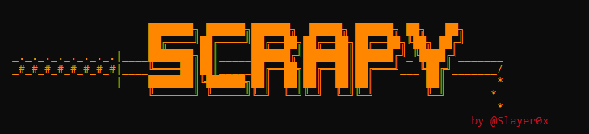

<h1>📦 Scrapy Python3 Script 📦</h1>

    

All functionalities from this script have been developed using Python Scapy library.

<h2>📚 Menu Options</h2>

<ol>
   <li><b>TCP Packet:</b></li> 
      <ol>Allows crafting custom TCP Packets and capture the response from the destination host.</ol> 
   <li><b>UDP Packet:</b></li>  
      <ol>Allows crafting custom UDP Packets and capture the response from the destination host.</ol> 
   <li><b>Sniffing:</b></li> 
      <ol>Allows sniffing traffic from multiple interfaces simultaneously employing custom filters and saving the result as a .pcap file</ol> 
   <li><b>MITM ARP Spoofing (Linux Only):</b></li> 
      <ol>Automates MITM ARPSpoofing Attacks</ol> 
   <li><b>Replay .pcap:</b></li> 
      <ol>Allows loading and replaying traffic from a .pcap capture file</ol> 
   <li><b>Exit:</b></li> 
      <ol>Quits the program.</ol>
</ol>
